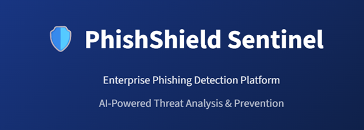
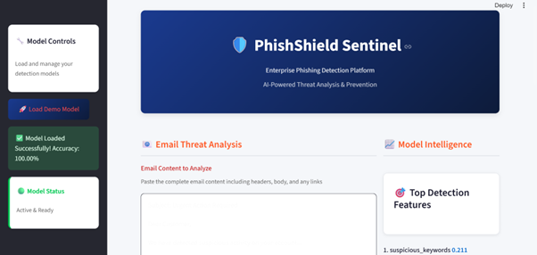
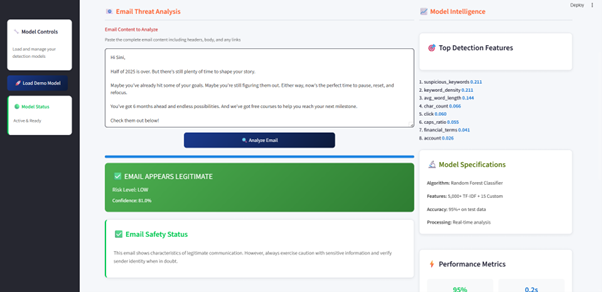
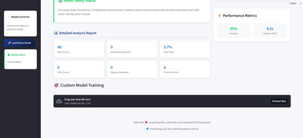

# PhishShield Sentinel: AI-Powered Phishing Detection System



## Overview

PhishShield Sentinel is an enterprise-grade cybersecurity solution designed to identify and mitigate phishing threats in electronic communications. This system employs advanced machine learning techniques to analyze both textual content and URL features, providing real-time classification of potential phishing attempts with high accuracy.

[](https://ai-powered-phishing-detection-system-ples7i6bq2tzkaguiykzzt.streamlit.app/)

## Key Features

- **Comprehensive Email Analysis**: Utilizes statistical, linguistic, and behavioral pattern recognition to evaluate email content
- **URL Threat Assessment**: Identifies malicious links, URL shorteners, suspicious top-level domains, and potential redirects
- **Machine Learning Framework**: Implements a hybrid Random Forest Classifier combining TF-IDF vectorization with custom phishing indicators
- **Interactive Dashboard**: Features an intuitive user interface built with Streamlit
- **Model Transparency**: Provides feature importance analysis and confidence scoring for each prediction
- **Custom Training Capabilities**: Supports model retraining with organization-specific datasets
- **Real-Time Processing**: Delivers threat assessments with sub-second response times

## Technical Specifications

### Core Technologies

| Component | Technology |
|-----------|------------|
| Frontend Interface | Streamlit |
| Backend Processing | Python 3.8+ |
| Machine Learning Framework | scikit-learn |
| Natural Language Processing | NLTK |
| Data Handling | pandas |
| Web Content Analysis | BeautifulSoup |

## Implementation Guide

### System Requirements

- Python 3.8 or later
- pip package manager

### Installation Procedure

1. Clone the repository:
   ```bash
   git clone https://github.com/yourusername/PhishShield-Sentinel.git
   cd PhishShield-Sentinel
   ```

2. Create and activate a virtual environment:
   ```bash
   python -m venv venv
   source venv/bin/activate    # Unix-based systems
   venv\Scripts\activate       # Windows systems
   ```

3. Install required dependencies:
   ```bash
   pip install -r requirements.txt
   ```

4. Launch the application:
   ```bash
   streamlit run phishing_detection.py
   ```

## Operational Instructions

### Model Training Protocol

1. Prepare a CSV dataset containing:
   - `email_body`: Complete text content of emails
   - `label`: Binary classification (1 for phishing, 0 for legitimate)

2. Initiate the training process via the "Train Custom Model" interface

3. Review the generated accuracy metrics and classification report

### Email Analysis Procedure

1. Input email content into the designated text field
2. Execute analysis via the "Analyze Email" function
3. Examine the comprehensive threat assessment including:
   - Risk classification
   - Confidence metric
   - Feature analysis breakdown

## Example Communications

**Phishing Attempt:**
```
Security Alert: Your banking credentials require immediate verification. Click here to prevent account suspension: http://fake-bank-secure.com/login
```

**Legitimate Communication:**
```
Dear Colleague, Please find attached the quarterly financial report for your review. Regards, Accounting Department
```

## Performance Metrics

| Evaluation Metric | Performance Value |
|-------------------|-------------------|
| Classification Algorithm | Random Forest |
| Feature Dimensions | 5,000+ TF-IDF features + 15 custom indicators |
| Accuracy | ≥95% |
| Processing Latency | ≤200ms |

## System Demonstration





## Contact Information

For inquiries regarding this project, please contact:

- Email: [sinitp2015@gmail.com]
- Professional Network: [LinkedIn Profile](https://www.linkedin.com/in/sini-t-p-11846a169/)
